# r2d2-helmet

A project for an R2D2 costume helmet.

(pls dont sue me, Mr. Mouse)

---

## Hardware

| Part                   | PID  | Role                                  |
| ---------------------- | ---- | ------------------------------------- |
| Adafruit KB2040        | 5302 | RP2040 MCU, Pro Micro form factor     |
| Breadboard NeoPixel ×2 | 1312 | SK6812, dome lighting behind diffuser |
| STEMMA Speaker         | 3885 | PAM8302A class-D + 1 W 8 Ω speaker    |
| 1.9" 320×170 IPS TFT   | 5394 | ST7789, logic display panel           |

Passives: 2× 1 kΩ, 2× 10 nF, 1× 470 Ω, 1× 100 µF electrolytic, 1× 470 µF
electrolytic. Plus one momentary pushbutton (normally open) as the sound trigger —
no resistor needed, the RP2040's internal pull-up handles it.

Powered from a **USB power bank** into the KB2040's USB-C.

The 5394 ships with a 1×11 0.1" header strip. Solder it and breadboard directly —
the EYESPI FPC connector alongside it carries the same signals and goes unused, so
no EYESPI breakout or cable is needed.

### 5394 display header, pad 1 → 11

Order verified against the net list in Adafruit's Eagle board file (`JP1`) and
cross-checked against the guide's own breadboard wiring list. **Note `MISO` comes
before `MOSI`** — the reverse of most Adafruit breakouts.

| # | Silk   | Signal                                          |
| - | ------ | ----------------------------------------------- |
| 1 | `Vin`  | 3–5 V in — onboard LDO + level shifter          |
| 2 | `3V`   | 3.3 V regulator **output**, ≥100 mA — leave free |
| 3 | `Gnd`  | ground                                          |
| 4 | `SCK`  | SPI clock                                       |
| 5 | `MISO` | microSD only — **not used**, TFT is write-only   |
| 6 | `MOSI` | SPI data in                                     |
| 7 | `TCS`  | TFT chip select                                 |
| 8 | `RST`  | TFT reset (auto-reset circuit onboard)          |
| 9 | `DC`   | TFT data/command select                         |
| 10 | `SDCS` | microSD chip select — **not used**             |
| 11 | `Lite` | backlight enable — **pulled high, leave unconnected** |

### Pin assignments

Verified against `variants/adafruit_kb2040/pins_arduino.h` (arduino-pico) and
`ports/raspberrypi/boards/adafruit_kb2040/pins.c` (CircuitPython). Both agree.

| Silkscreen | GPIO | PWM slice | Used for                  |
| ---------- | ---- | --------- | ------------------------- |
| D8         | GP8  | 4A        | Audio PWM out → RC filter |
| D5         | GP5  | 2B        | NeoPixel data             |
| D6         | GP6  | 3A        | Periscope servo (later)   |
| D7         | GP7  | 3B        | TFT D/C                   |
| D4         | GP4  | 2A        | TFT reset                 |
| D10        | GP10 | 5A        | TFT chip select           |
| D2         | GP2  | 1A        | Trigger button → GND      |
| SCK        | GP18 | 1A        | TFT clock (SPI0)          |
| MOSI       | GP19 | 1B        | TFT data (SPI0)           |

Unused and free: D0/D1 (GP0/GP1, Serial1), D3 (GP3), D9 (GP9), MISO (GP20),
A0–A3 (GP26/GP27/GP28/GP29), STEMMA QT port (GP12/GP13). GP11 is the onboard BOOT
button and GP17 is the onboard NeoPixel — neither is castellated.

There is **no microSD in this build** — sounds are synthesized and the display
draws primitives, so `MISO` and `SDCS` on the 5394 stay unwired.

`PWMAudio` claims all of PWM slice 4, so **GP9 gets no `analogWrite()`** if it's
ever pressed into service.

---

## Wiring

### Board pin geometry

The KB2040 is Pro Micro shaped: 12 castellated pads per edge, USB-C at the top.

```
              USB-C
        ┌───────────────┐
  D0/TX │1           24│ RAW      <- 5V from USB, 500mA polyfuse
  D1/RX │2           23│ GND
    GND │3           22│ RST
    GND │4           21│ 3V       <- 3.3V reg out, 500 mA
     D2 │5           20│ A3
     D3 │6           19│ A2
     D4 │7           18│ A1
     D5 │8           17│ A0
     D6 │9           16│ SCK
     D7 │10          15│ MISO
     D8 │11          14│ MOSI
     D9 │12          13│ D10
        └───────────────┘
         STEMMA QT on end (GP12/GP13)
```

`D2` sits two pads from the pair of `GND` pins, which is why the trigger button
lands there — it's a short hop on the breadboard.

### Full schematic

```mermaid
flowchart TB

  %% ============ POWER ============
  subgraph PWR["⚡ Power rails"]
    direction TB
    USB["USB-C<br/>5 V in"]
    RAW["RAW pin<br/><b>5 V</b> · fused 500 mA–1 A"]
    V3["3V pin<br/><b>3.3 V</b> · 500 mA total<br/><i>incl. the MCU itself</i>"]
    GND(["GND<br/><b>common — tie all together</b>"])
    USB --> RAW
    RAW -->|"onboard LDO"| V3
  end

  %% ============ MCU ============
  subgraph MCU["🧠 Adafruit KB2040 · RP2040 @ 133 MHz"]
    direction TB
    P_D8["<b>D8</b> · GP8<br/>PWM slice 4A"]
    P_D5["<b>D5</b> · GP5"]
    P_SCK["<b>SCK</b> · GP18"]
    P_MOSI["<b>MOSI</b> · GP19"]
    P_D7["<b>D7</b> · GP7"]
    P_D4["<b>D4</b> · GP4"]
    P_D10["<b>D10</b> · GP10"]
    P_D2["<b>D2</b> · GP2"]
  end

  %% ============ AUDIO ============
  subgraph AUD["🔊 Audio chain"]
    direction LR
    R1["R1<br/>1 kΩ"]
    N1(("node A"))
    C1["C1<br/>10 nF"]
    R2["R2<br/>1 kΩ"]
    N2(("node B"))
    C2["C2<br/>10 nF"]
    CB1["C_bulk<br/>470 µF"]
    subgraph SPK["STEMMA Speaker 3885 · PAM8302A"]
      direction TB
      S_SIG["<b>SIG</b> pad / white wire<br/>0–3 V in · AC-coupled 1.0 µF onboard"]
      S_VCC["<b>+</b> pad / red wire<br/>3–5 V"]
      S_GND["<b>−</b> pad / black wire"]
      S_POT["🔧 volume trim pot<br/><b>start at minimum</b>"]
      S_OUT["1 W 8 Ω speaker<br/>~250 kHz class-D switching"]
      S_SIG --> S_POT --> S_OUT
    end
  end

  P_D8 -->|"PWM carrier 130 kHz<br/>22.05 kS/s"| R1
  R1 --> N1
  N1 --> C1
  C1 --> GND
  N1 --> R2
  R2 --> N2
  N2 --> C2
  C2 --> GND
  N2 -->|"filtered audio<br/>2-pole, fc ≈ 15.9 kHz"| S_SIG
  RAW -->|"5 V"| S_VCC
  RAW --> CB1
  CB1 --> GND
  S_GND --> GND

  %% ============ NEOPIXELS ============
  subgraph NPX["💡 NeoPixel chain · 2× SK6812"]
    direction LR
    R3["R3<br/>470 Ω"]
    CB2["C_bulk<br/>100 µF"]
    NP1["Pixel 1<br/>DIN→DOUT"]
    NP2["Pixel 2<br/><i>DOUT unused</i>"]
    NP1 -->|"DOUT→DIN"| NP2
  end

  P_D5 -->|"800 kHz data<br/>3.3 V logic"| R3
  R3 -->|"to DIN of pixel 1"| NP1
  V3 -->|"<b>3.3 V — not 5 V</b><br/>drops V_IH to 2.31 V"| CB2
  CB2 --> NP1
  CB2 --> GND

  %% ============ DISPLAY ============
  subgraph DISP["🖥️ Logic display · Adafruit 5394"]
    direction TB
    subgraph HDR["1×11 0.1in header · solder the included strip"]
      direction TB
      E_VIN["1 · <b>Vin</b>"]
      E_3V["2 · <b>3V</b><br/><i>regulator OUT — leave free</i>"]
      E_GND["3 · <b>Gnd</b>"]
      E_SCK["4 · <b>SCK</b>"]
      E_MISO["5 · <b>MISO</b><br/><i>no microSD — unwired</i>"]
      E_MOSI["6 · <b>MOSI</b>"]
      E_TCS["7 · <b>TCS</b>"]
      E_RST["8 · <b>RST</b>"]
      E_DC["9 · <b>DC</b>"]
      E_SDCS["10 · <b>SDCS</b><br/><i>no microSD — unwired</i>"]
      E_LITE["11 · <b>Lite</b><br/><i>pulled high — leave floating</i>"]
    end
    TFT["1.9in 320×170 IPS · ST7789<br/>visible area 46 × 25 mm<br/>onboard 3.3 V LDO + 3/5 V level shifter<br/>microSD slot<br/><i>EYESPI FPC connector unused</i>"]
    HDR ==>|"same board"| TFT
  end

  P_SCK  -->|"8–12 MHz to start"| E_SCK
  P_MOSI --> E_MOSI
  P_D7   --> E_DC
  P_D4   --> E_RST
  P_D10  --> E_TCS
  V3     -->|"3.3 V"| E_VIN
  E_GND  --> GND

  %% ============ TRIGGER ============
  subgraph BTN["🔘 Trigger"]
    SW["Momentary pushbutton<br/>normally open"]
  end

  P_D2 -->|"INPUT_PULLUP<br/>reads LOW when pressed"| SW
  SW --> GND

  classDef pwr fill:#4a2c00,stroke:#ffa726,stroke-width:2px,color:#ffe0b2
  classDef mcu fill:#00332b,stroke:#26a69a,stroke-width:2px,color:#b2dfdb
  classDef aud fill:#3a0d2e,stroke:#ec407a,stroke-width:2px,color:#f8bbd0
  classDef npx fill:#0d2137,stroke:#42a5f5,stroke-width:2px,color:#bbdefb
  classDef dsp fill:#1a2e05,stroke:#9ccc65,stroke-width:2px,color:#dcedc8
  classDef btn fill:#33291a,stroke:#ffb74d,stroke-width:2px,color:#ffe0b2
  class USB,RAW,V3,GND pwr
  class P_D8,P_D5,P_SCK,P_MOSI,P_D7,P_D4,P_D10,P_D2 mcu
  class R1,R2,C1,C2,N1,N2,CB1,S_SIG,S_VCC,S_GND,S_POT,S_OUT aud
  class R3,CB2,NP1,NP2 npx
  class E_VIN,E_3V,E_GND,E_SCK,E_MOSI,E_MISO,E_DC,E_RST,E_TCS,E_SDCS,E_LITE,TFT dsp
  class SW btn
```



### Connection table

Wire it from this, not from the diagram — the diagram shows topology, this shows nets.

**Audio**

| From               | To                                           |
| ------------------ | -------------------------------------------- |
| KB2040 `D8` (GP8)  | R1 (1 kΩ) leg 1                              |
| R1 leg 2           | node A — R2 leg 1, and C1 (10 nF) leg 1      |
| C1 leg 2           | GND                                          |
| R2 leg 2           | node B — C2 (10 nF) leg 1, and speaker `SIG` |
| C2 leg 2           | GND                                          |
| KB2040 `RAW` (5 V) | speaker `+` (red), and C_bulk 470 µF `+`     |
| C_bulk 470 µF `−`  | GND                                          |
| KB2040 `GND`       | speaker `−` (black)                          |

STEMMA Speaker JST PH 3-pin: **white = SIG, red = +, black = −**. The same three
signals are on the large alligator/sew pads, labelled `SIG` / `+` / `−`.

**NeoPixels**

| From              | To                                                      |
| ----------------- | ------------------------------------------------------- |
| KB2040 `D5` (GP5) | R3 (470 Ω) leg 1                                        |
| R3 leg 2          | pixel 1 `DIN`                                           |
| KB2040 `3V`       | pixel 1 + 2 `+` (in parallel), and C_bulk 100 µF `+`    |
| KB2040 `GND`      | pixel 1 + 2 `−` (in parallel), and C_bulk 100 µF `−`    |
| pixel 1 `DOUT`    | pixel 2 `DIN`                                           |
| pixel 2 `DOUT`    | leave unconnected                                       |

Each pixel has 3 pads per side; the two sides mirror each other except that data
is `DIN` on one side and `DOUT` on the other. Power and ground are common across
both sides, so you can daisy-chain in either direction.

**Display** — 5394 header straight into the breadboard, wire by silkscreen label:

| 5394 pad | KB2040                                                  |
| -------- | ------------------------------------------------------- |
| `Vin`    | `3V`                                                    |
| `3V`     | **leave unconnected** — this is an output, not an input  |
| `Gnd`    | `GND`                                                   |
| `SCK`    | `SCK` (GP18)                                            |
| `MISO`   | **leave unconnected** — no microSD in this build         |
| `MOSI`   | `MOSI` (GP19)                                           |
| `TCS`    | `D10` (GP10)                                            |
| `RST`    | `D4` (GP4)                                              |
| `DC`     | `D7` (GP7)                                              |
| `SDCS`   | **leave unconnected** — no microSD in this build         |
| `Lite`   | **leave unconnected** — pulled high, backlight full on  |

Seven wires total. The EYESPI FPC connector carries these same signals and stays
empty.

**Trigger button**

| From              | To                        |
| ----------------- | ------------------------- |
| KB2040 `D2` (GP2) | button leg 1              |
| button leg 2      | `GND`                     |

Configured `INPUT_PULLUP`, so the pin idles high and reads LOW when pressed. No
pull-up resistor and no debounce cap — debouncing is done in software. `D2` is
physically adjacent to the two `GND` pads, so this is a two-pin hop on the
breadboard.

---

## Audio filter response

The two RC sections are unbuffered, so they load each other — the denominator is
`1 + 3sRC + (sRC)²`, not `(1 + sRC)²` — and the speaker's 10 kΩ trim pot hangs off
the output as a third load. The real response is well below the 15.9 kHz a single
isolated section would give:

| Network | 3 k | 5 k | 8 k | 11 k | 130 k | −3 dB |
| ------- | --- | --- | --- | ---- | ----- | ----- |
| **2× (1 kΩ, 10 nF)** — as wired | −2.3 | −3.3 | −5.2 | −7.1 | **−36.9** | **7.0 kHz** |
| 2× (1 kΩ, 6.8 nF) | −1.9 | −2.5 | −3.6 | −4.9 | −30.7 | 10.3 kHz |
| 2× (1 kΩ, 4.7 nF) | −1.8 | −2.0 | −2.7 | −3.5 | −25.1 | 14.9 kHz |

(dB, including the pot's loading. −3 dB is of the whole network, not one section.)

As wired it's a dull-but-clean starting point: −37 dB of carrier rejection, at the
cost of a soft top end. The little enclosed 8 Ω speaker rolls off up there anyway.
If it sounds muffled, swapping both caps to 4.7 nF is a two-part change.

**Never set the PWM carrier to 260 kHz.** The PAM8302A switches at ~250 kHz, so a
260 kHz carrier beats against it at **10 kHz** — dead centre of the audio band.
That rules out 9-bit resolution at 133 MHz. 130 kHz (10-bit) and 520 kHz (8-bit)
both stay clear; this build uses 130 kHz.

Our 2 kΩ of series resistance against the pot's 10 kΩ also divides the 3.3 V swing
down to 2.75 V at `SIG`, which lands inside Adafruit's stated 0–3 V input range
without any extra divider.

---

## Software shape

Decided up front because it constrains the wiring and the bring-up order:

- **`PWMAudio` lives entirely on core1** (`setup1()` / `loop1()`); core0 owns the
  display, the pixels, and the logic. A full-screen 320×170 blit is ~109 KB, about
  36 ms of blocking SPI — longer than PWMAudio's default ~23 ms of buffering, so
  synthesis cannot live in `loop()`. Putting it on core1 also installs the DMA IRQ
  on core1's NVIC, out of reach of the `noInterrupts()` inside `NeoPixel::show()`.
- **Sounds are synthesized, not sampled.** No microSD, no assets.
- **The display draws a coarse block grid** — the front logic display look, which is
  what the astromech community builds out of LED matrices. Only changed cells get
  redrawn, so it's cheap.
- **The button is the trigger.** Idle chirping on a randomized timer is a small
  addition on top if it feels too silent.
- **Start SPI at 8–12 MHz** and raise it once the display is stable. 24 MHz over
  breadboard jumpers is optimistic. `pins_arduino.h` already maps `SPI` to
  GP18/19/20, so the default `SPI` object needs no `setSCK()` calls.

---

## Things that will bite you

**Tie every ground together.** MCU, speaker, pixels, display. The most common
cause of a PWM audio path that hums or does nothing is a floating amp ground.

**Start the speaker trim pot at minimum.** Gain is a fixed 24 dB and the pot is
the only hardware volume control. A 3.3 V p-p signal into a 1 W speaker with the
pot up will clip hard.

**Set loudness with the pot, not in software.** The pot is a 10 kΩ divider ahead
of a fixed-gain amp, so the amp's noise floor is the same wherever you set it — but
the PWM DAC only has 10 bits, and every 6 dB of software attenuation throws away a
bit. Drive the PWM near full scale and turn the screw. Software gain is for
expression *within* a sound, not master volume.

**The amp has no mute.** `/SD` is hardwired to `VDD` on the STEMMA board, so the
PAM8302A is powered up whenever `RAW` is. There is no way to silence it from code
short of cutting a trace.

**The 470 µF at the amp is not optional.** Class-D current spikes on transients sag
`RAW` enough to brown out the MCU. It shows up as random resets that only appear
once audio and lights run together, which is a miserable thing to debug later.

**Power the pixels from `3V`, not `RAW`.** SK6812 needs a data high of 0.7 × VDD.
At 5 V that's 3.5 V and the RP2040 only puts out 3.3 V — marginal. At 3.3 V the
threshold drops to 2.31 V and there's plenty of margin. Slightly dimmer output,
which is fine behind a diffuser.

**Expect the whites to skew warm.** 3.3 V is under SK6812's 3.5 V minimum, and the
blue and green dies have the highest forward voltage, so they starve first. Dim is
fine; pink-white may not be. If the color bothers you, one silicon diode from `RAW`
gives ~4.0–4.3 V, where V_IH is 2.8–3.0 V and a 3.3 V GPIO still drives it.

**3.3 V rail budget:** the regulator supplies 500 mA _including the MCU_. Two
pixels at full white plus the display's backlight is roughly 150 mA of that, ~180 mA
with the MCU. Comfortable — there's headroom here if the pixel count grows later.

**`RAW`'s 500 mA polyfuse is the real ceiling, and the 3.3 V regulator draws
through it too.** Average load is ~280 mA with transient peaks near 530 mA, so it
holds — but the fuse's series resistance is part of why the 470 µF matters. A
periscope servo later would blow straight past it (stall is 0.5–1 A); there's a
`USB+ → RAW` solder jumper on the back of the KB2040 for up to 2 A when that day
comes.

**Support the display panel mechanically.** Adafruit's own warning: 5394 was
designed for smartwatches where cover glass retains it, and "without something
gently holding the screen down, the backlight can eventually peel away from the
TFT." The dome faceplate needs to press lightly on the display face.

**`3V` on the display is an output, not an input.** It's the onboard regulator's
3.3 V rail brought out for convenience. Feeding the KB2040's `3V` into it instead
of `Vin` ties two regulator outputs together. Power goes to `Vin`.

**`MISO` sits before `MOSI` on this header** — pads 5 and 6, the reverse of the
order most Adafruit breakouts use. Easy to swap on autopilot; the display still
works when you do, because the TFT is write-only and never uses `MISO`. You'd only
find out when the microSD refuses to mount.

**`Lite` needs no wire.** It's pulled high on the display board, so the backlight
runs full on with the pad floating. There is no brightness control in this build
and no GPIO spent on one.

See [`docs/wiring.md`](docs/wiring.md) for the parts research and
[`docs/hardware-notes.md`](docs/hardware-notes.md) for the toolchain and audio
findings.
