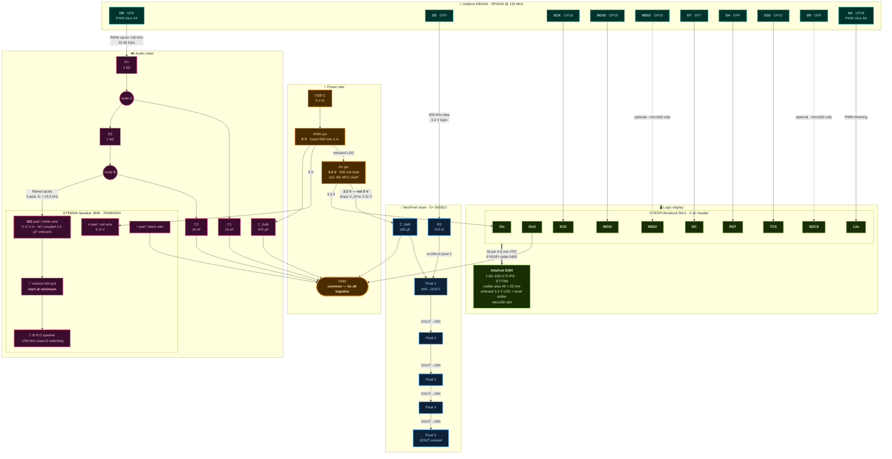

# r2d2-helmet

A project for an R2D2 costume helmet.

(pls dont sue me, Mr. Mouse)

---

## Hardware

| Part                   | PID  | Role                                  |
| ---------------------- | ---- | ------------------------------------- |
| Adafruit KB2040        | 5302 | RP2040 MCU, Pro Micro form factor     |
| Breadboard NeoPixel ×5 | 1312 | SK6812, dome lighting behind diffuser |
| STEMMA Speaker         | 3885 | PAM8302A class-D + 1 W 8 Ω speaker    |
| 1.9" 320×170 IPS TFT   | 5394 | ST7789, logic display panel           |
| EYESPI Breakout        | 5613 | Required — 5394 has no 0.1" header    |
| EYESPI Cable 50 mm     | 5462 | 18-pin 0.5 mm FPC, A-B type           |

Passives: 2× 1 kΩ, 2× 10 nF, 1× 470 Ω, 1× 100 µF electrolytic, 1× 470 µF electrolytic.

### Pin assignments

Verified against `variants/adafruit_kb2040/pins_arduino.h` (arduino-pico) and
`ports/raspberrypi/boards/adafruit_kb2040/pins.c` (CircuitPython). Both agree.

| Silkscreen | GPIO | PWM slice | Used for                  |
| ---------- | ---- | --------- | ------------------------- |
| D8         | GP8  | 4A        | Audio PWM out → RC filter |
| D5         | GP5  | 2B        | NeoPixel data             |
| D6         | GP6  | 3A        | Periscope servo (later)   |
| D7         | GP7  | 3B        | TFT D/C                   |
| D4         | GP4  | 2A        | TFT reset                 |
| D10        | GP10 | 5A        | TFT chip select           |
| D9         | GP9  | 4B        | SD chip select (optional) |
| SCK        | GP18 | 1A        | TFT clock (SPI0)          |
| MOSI       | GP19 | 1B        | TFT data (SPI0)           |
| MISO       | GP20 | 2A        | SD data out (optional)    |
| A2         | GP28 | 6A        | TFT backlight PWM         |

Unused and free: D0/D1 (GP0/GP1, Serial1), D2/D3 (GP2/GP3, Wire1), A0/A1/A3
(GP26/GP27/GP29), STEMMA QT port (GP12/GP13). GP11 is the onboard BOOT button and
GP17 is the onboard NeoPixel — neither is castellated.

`PWMAudio` claims all of PWM slice 4, so **GP9 must stay digital-only** — no
`analogWrite()` on it.

---

## Wiring

### Board pin geometry

The KB2040 is Pro Micro shaped: 12 castellated pads per edge, USB-C at the top.

```
              USB-C
        ┌───────────────┐
  D0/TX │1           24│ RAW      <- 5V from USB, fused
  D1/RX │2           23│ GND
    GND │3           22│ RST
    GND │4           21│ 3V       <- 3.3V reg out, 500 mA
     D2 │5           20│ A3
     D3 │6           19│ A2       <- TFT backlight
     D4 │7           18│ A1
     D5 │8           17│ A0
     D6 │9           16│ SCK
     D7 │10          15│ MISO
     D8 │11          14│ MOSI
     D9 │12          13│ D10
        └───────────────┘
         STEMMA QT on end (GP12/GP13)
```

### Full schematic



### Connection table

Wire it from this, not from the diagram — the diagram shows topology, this shows nets.

**Audio**

| From               | To                                           |
| ------------------ | -------------------------------------------- |
| KB2040 `D8` (GP8)  | R1 (1 kΩ) leg 1                              |
| R1 leg 2           | node A — R2 leg 1, and C1 (10 nF) leg 1      |
| C1 leg 2           | GND                                          |
| R2 leg 2           | node B — C2 (10 nF) leg 1, and speaker `SIG` |
| C2 leg 2           | GND                                          |
| KB2040 `RAW` (5 V) | speaker `+` (red), and C_bulk 470 µF `+`     |
| C_bulk 470 µF `−`  | GND                                          |
| KB2040 `GND`       | speaker `−` (black)                          |

STEMMA Speaker JST PH 3-pin: **white = SIG, red = +, black = −**. The same three
signals are on the large alligator/sew pads, labelled `SIG` / `+` / `−`.

**NeoPixels**

| From              | To                                                      |
| ----------------- | ------------------------------------------------------- |
| KB2040 `D5` (GP5) | R3 (470 Ω) leg 1                                        |
| R3 leg 2          | pixel 1 `DIN`                                           |
| KB2040 `3V`       | pixel 1..5 `+` (all in parallel), and C_bulk 100 µF `+` |
| KB2040 `GND`      | pixel 1..5 `−` (all in parallel), and C_bulk 100 µF `−` |
| pixel N `DOUT`    | pixel N+1 `DIN`                                         |
| pixel 5 `DOUT`    | leave unconnected                                       |

Each pixel has 3 pads per side; the two sides mirror each other except that data
is `DIN` on one side and `DOUT` on the other. Power and ground are common across
both sides, so you can daisy-chain in either direction.

**Display** — via EYESPI breakout, wire by silkscreen label:

| EYESPI breakout | KB2040                                |
| --------------- | ------------------------------------- |
| `Vin`           | `3V`                                  |
| `Gnd`           | `GND`                                 |
| `SCK`           | `SCK` (GP18)                          |
| `MOSI`          | `MOSI` (GP19)                         |
| `DC`            | `D7` (GP7)                            |
| `RST`           | `D4` (GP4)                            |
| `TCS`           | `D10` (GP10)                          |
| `Lite`          | `A2` (GP28)                           |
| `MISO`          | `MISO` (GP20) — only if using microSD |
| `SDCS`          | `D9` (GP9) — only if using microSD    |

Leave `SDA`, `SCL`, `GP1`, `GP2`, `TSCS`, `MEMCS`, `BUSY`, `INT` unconnected —
this display has no touch panel, no onboard RAM, and is not eInk.

`Lite` can go straight to `3V` if you don't want software brightness control.

---

## Things that will bite you

**Tie every ground together.** MCU, speaker, pixels, display. The most common
cause of a PWM audio path that hums or does nothing is a floating amp ground.

**Start the speaker trim pot at minimum.** The PAM8302A has gain and the RC
network doesn't attenuate much in-band. A 3.3 V p-p signal into a 1 W speaker with
the pot up will clip hard.

**The 470 µF at the amp is not optional.** Class-D current spikes on transients sag
`RAW` enough to brown out the MCU. It shows up as random resets that only appear
once audio and lights run together, which is a miserable thing to debug later.

**Power the pixels from `3V`, not `RAW`.** SK6812 needs a data high of 0.7 × VDD.
At 5 V that's 3.5 V and the RP2040 only puts out 3.3 V — marginal. At 3.3 V the
threshold drops to 2.31 V and there's plenty of margin. Slightly dimmer output,
which is fine behind a diffuser.

**3.3 V rail budget:** the regulator supplies 500 mA _including the MCU_. Five
pixels at full white plus the display's backlight is roughly 260 mA of that. Fine
as specified — just don't add a second string to this rail.

**Support the display panel mechanically.** Adafruit's own warning: 5394 was
designed for smartwatches where cover glass retains it, and "without something
gently holding the screen down, the backlight can eventually peel away from the
TFT." The dome faceplate needs to press lightly on the display face.

**Check for solder pads before ordering the EYESPI parts.** Every Adafruit source
for 5394 documents only the 18-pin FPC connector, but look at the physical board —
if it has a 0.1" header row you can skip 5613 and 5462 entirely and wire direct.

See [`docs/wiring.md`](docs/wiring.md) for the parts research and
[`docs/hardware-notes.md`](docs/hardware-notes.md) for the toolchain and audio
findings.
